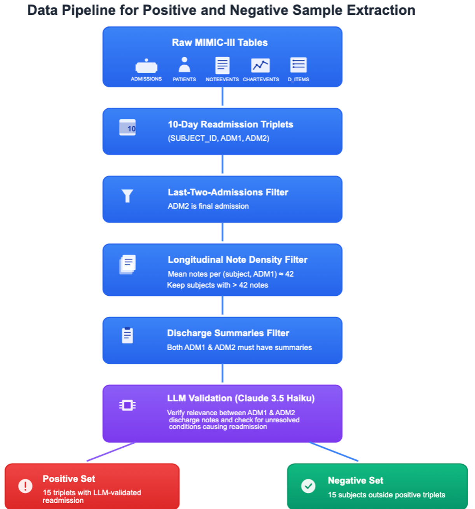
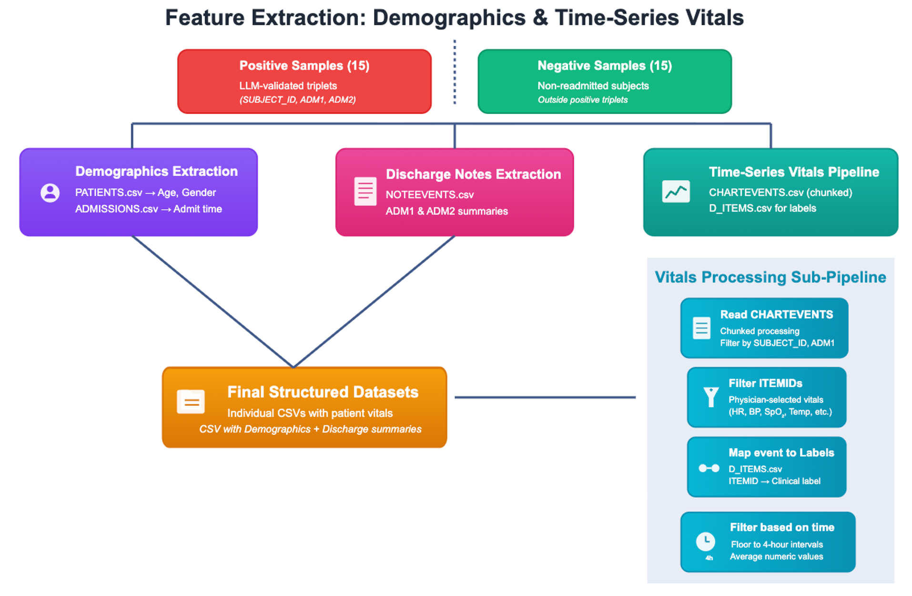
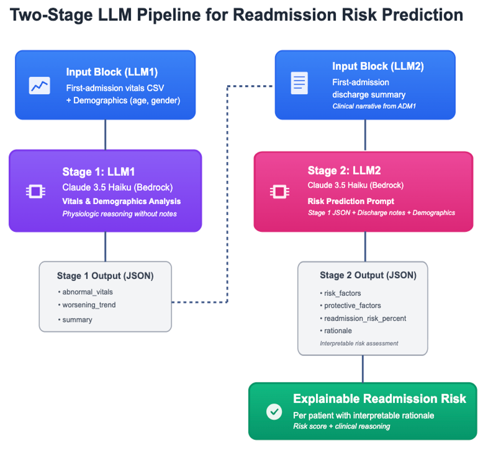
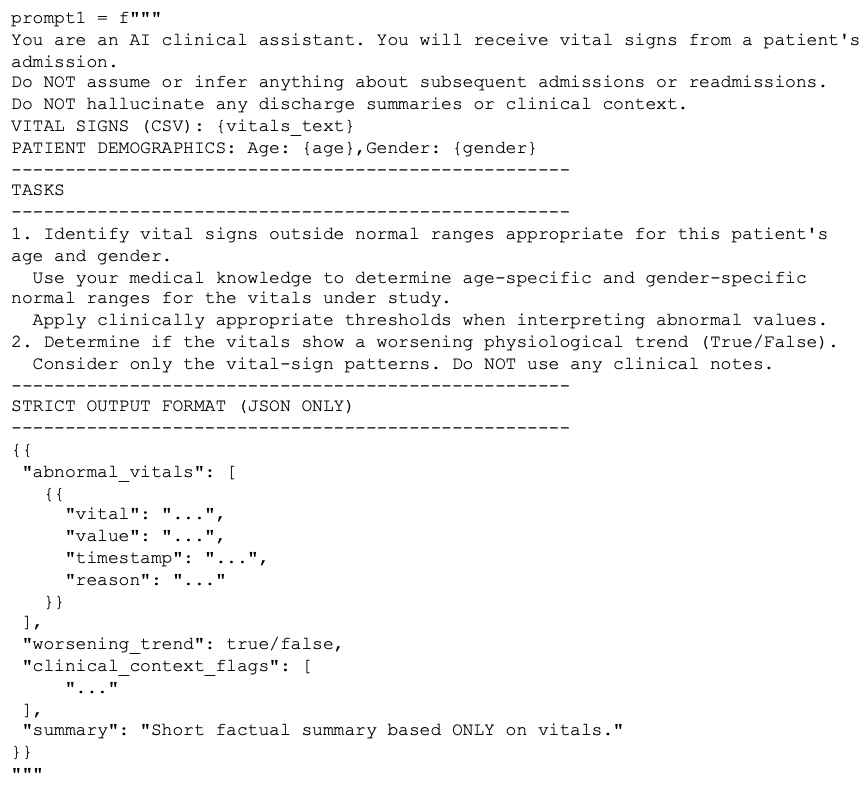
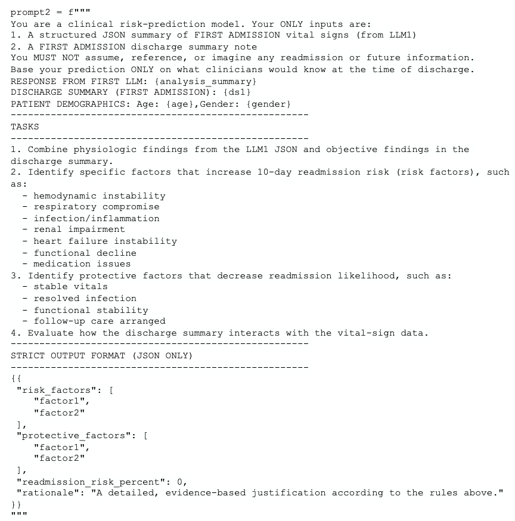

# 🏥 Multi-Stage LLM Hospital Readmission Predictor

A two-stage Large Language Model pipeline that predicts **10-day unplanned hospital readmissions** from clinical discharge notes and time-series vital signs — with evidence-grounded reasoning validated by both human clinicians and an LLM-as-judge framework.

> Built on **MIMIC-III** · Deployed via **AWS Bedrock (Claude 3.5 Haiku)** · **93.8% recall** on positive class

---

## 📋 Table of Contents

- [Overview](#overview)
- [Data Pipeline](#data-pipeline)
- [System Architecture](#system-architecture)
- [LLM Prompts](#llm-prompts--outputs)
- [Results](#results)
- [Repository Structure](#repository-structure)
- [Setup & Installation](#setup--installation)
- [How to Run](#how-to-run)
- [Evaluation](#evaluation)

---

## Overview

Hospital readmissions impose a significant financial and clinical burden — approximately **15–20% of patients are readmitted within 30 days**, costing an estimated **$20 billion annually**. Many of these readmissions stem from unresolved conditions that are documented but overlooked at discharge.

This project addresses that gap by building a pipeline that:

1. **Analyzes** time-series vital signs to detect abnormal patterns and physiologic deterioration
2. **Combines** those findings with discharge summaries to assess 10-day readmission risk
3. **Explains** each prediction with a clinically grounded rationale traceable to specific patient data

The design prioritizes **interpretability** and **structured clinical reasoning** over black-box prediction — making outputs actionable for clinicians, not just researchers.

---

## Data Pipeline

### Step 1 — Positive & Negative Sample Extraction

Starting from the raw MIMIC-III tables, patients are filtered through a multi-step pipeline to construct a balanced cohort of 15 readmitted (positive) and 15 non-readmitted (negative) subjects. A final LLM validation step using Claude 3.5 Haiku confirms that the readmission was clinically linked to unresolved conditions from the first admission.



### Step 2 — Feature Extraction: Demographics & Time-Series Vitals

For each subject, demographics (age, gender), discharge summaries (ADM1 & ADM2), and time-series vital signs are extracted in parallel. The vitals sub-pipeline processes CHARTEVENTS in chunks, filters to 68 clinically selected parameters (HR, BP, SpO₂, Temp, etc.), maps ITEMIDs to human-readable labels, and bins readings into **4-hour intervals**.



---

## System Architecture

The prediction pipeline separates reasoning into two isolated LLM stages to enforce structured clinical thinking and prevent hallucination.



**Stage 1 — Physiologic Pattern Analysis (LLM1)**
- Input: First-admission vital signs + patient demographics
- Clinical notes are **strictly excluded** to prevent narrative leakage
- Output: Structured JSON flagging abnormal vitals, worsening trends, and clinical context flags

**Stage 2 — Comprehensive Risk Assessment (LLM2)**
- Input: Stage 1 JSON + first-admission discharge summary + demographics
- Synthesizes physiologic findings with the clinical narrative
- Output: Risk factors, protective factors, a readmission risk percentage, and a detailed evidence-based rationale

**Key design constraints applied to both stages:**
- JSON-only structured outputs to eliminate free-form hallucination
- Explicit prohibition on referencing or inferring any future or readmission data
- All predictions grounded only in what a clinician would know at the time of discharge

---

## LLM Prompts

### Stage 1 Prompt — Vitals & Demographics Analysis



### Stage 2 Prompt — Risk Prediction


<!-- 
### Sample Output — Stage 1 (LLM1 Vitals Analysis JSON)


### Sample Output — Stage 2 (LLM2 Readmission Prediction JSON)

 -->

---

## Results

### Classification Performance

| Metric | Will Be Readmitted | Will Not Be Readmitted |
|---|---|---|
| Recall | **93.8%** | 53.8% |
| Precision | 71.4% | **87.5%** |
| Error Rate | 6.25% | 46.2% |

The model is optimized for **high recall on the positive class** — the clinical priority is minimizing missed high-risk patients.

### Confusion Matrix

| | Predicted: No Readmission | Predicted: Readmission |
|---|---|---|
| **Actual: No Readmission** | 7 | 6 |
| **Actual: Readmission** | 1 | 15 |

### Reasoning Quality (scored out of 20)

| Criterion | LLM Judge | Human Expert |
|---|---|---|
| Clinical Accuracy | 4.80 / 5 | 4.33 / 5 |
| Evidence Grounding | 4.67 / 5 | 4.33 / 5 |
| Logical Coherence | 4.87 / 5 | 4.50 / 5 |
| Completeness & Specificity | 4.47 / 5 | 3.83 / 5 |
| **Total** | **18.80 / 20** | **17.17 / 20** |

Reasoning was evaluated only when the model's prediction matched ground truth. Final LLM judge scores are the median of three models: **Nova Pro**, **Claude 3.5 Sonnet**, and **Claude 4.5 Opus**.

---

## Repository Structure

```
LLM_Hospital_Readmission_Prediction/
│
├── notebooks/
│   ├── data_pipeline.ipynb          # Cohort construction, sample selection, vitals extraction
│   ├── two_stage_llm.ipynb          # Stage 1 & Stage 2 LLM prompting + prediction
│   ├── evaluation_metrics.ipynb     # Classification metrics + confusion matrix
│   └── llm_judge_evaluation.ipynb   # LLM-as-judge reasoning evaluation
│
├── assets/
│   ├── data_pipeline.png
│   ├── feature_extraction.png
│   ├── llm_pipeline.png
│   ├── stage1_prompt.png
│   ├── stage2_prompt.png
│   ├── stage1_output.png
│   └── stage2_output.png
│
├── requirements.txt
└── README.md
```

---

## Setup & Installation

### Prerequisites

- Python 3.9+
- AWS account with Bedrock access (Claude 3.5 Haiku enabled)
- MIMIC-III access

### Install Dependencies

```bash
git clone https://github.com/ketkipatankar18/LLM_Hospital_Readmission_Prediction.git
cd LLM_Hospital_Readmission_Prediction
pip install -r requirements.txt
```

### AWS Configuration

Before running any notebook, update the credentials cell at the top of each notebook directly:
```python
os.environ['AWS_BEARER_TOKEN_BEDROCK'] = "your_bedrock_token"
```

---

## How to Run

Run the notebooks in order:

```
notebooks/data_pipeline.ipynb        → Build cohort, extract vitals & notes
notebooks/two_stage_llm.ipynb        → Run Stage 1 & Stage 2 predictions
notebooks/evaluation_metrics.ipynb   → Compute classification metrics
notebooks/llm_judge_evaluation.ipynb → Score reasoning quality
```

## Evaluation

### Binary Classification

Standard metrics (precision, recall, error rate) computed on 30 patients (15 positive, 15 negative).

### LLM-as-Judge Reasoning Evaluation

Reasoning quality was scored on a 20-point rubric across four dimensions: Clinical Accuracy, Evidence Grounding, Logical Coherence, and Completeness & Specificity. Three independent LLM judges (Nova Pro, Claude 3.5 Sonnet, Claude 4.5 Opus) scored each rationale; the **median score** was taken as the final result. Scores were only computed when the model's prediction matched the ground truth label.

---

*Built with Claude 3.5 Haiku · AWS Bedrock · MIMIC-III · Python*